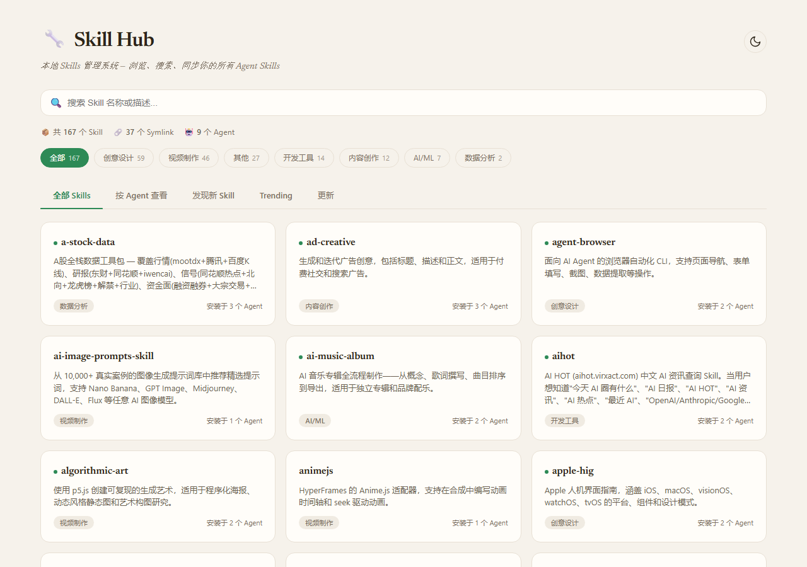
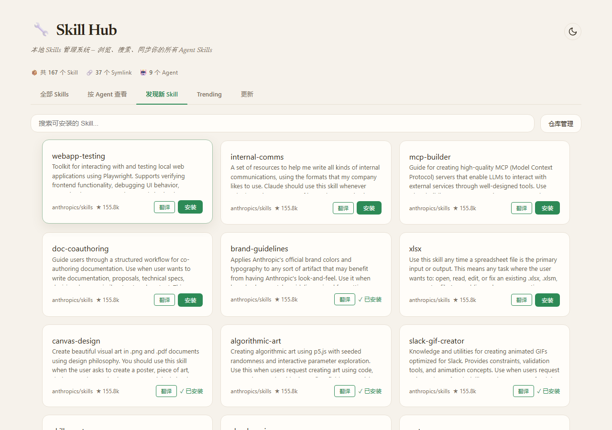
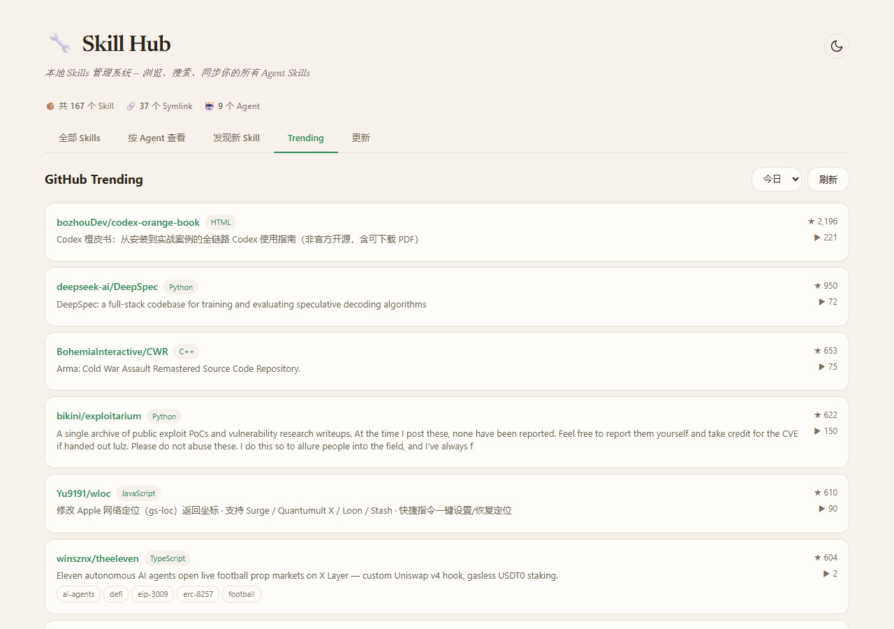

# Skill Hub

本地 Skills 管理系统 — 浏览、搜索、同步你的所有 Agent Skills。





## 功能

- **Skills 管理** — 浏览、搜索、分类查看已安装的 Agent Skills
- **发现新 Skills** — 从 GitHub 仓库发现并安装社区 Skills
- **GitHub Trending** — 查看 GitHub 热门 AI/Agent 项目
- **检查更新** — 一键检测已安装 Skills 是否有新版本
- **翻译支持** — 自动翻译英文 Skill 描述为中文
- **暗色模式** — 支持明暗主题切换

## 快速开始

```bash
# 安装依赖
pip install fastapi uvicorn

# 启动服务
python -m uvicorn app:app --host 127.0.0.1 --port 8765
```

或直接双击 `start.bat` 启动。

访问 http://localhost:8765

## 翻译功能

翻译功能使用百度翻译 API，需要申请密钥：

1. 前往 [百度翻译开放平台](https://fanyi-api.baidu.com/) 注册并开通「通用翻译」
2. 在项目根目录创建 `.env` 文件：

```
BAIDU_APPID=你的APP ID
BAIDU_KEY=你的密钥
```

## 项目结构

```
skill-hub/
├── app.py              # FastAPI 后端
├── templates/
│   └── index.html      # 单页前端
├── skill_repos.json    # GitHub 仓库配置
├── skill_zh_map.json   # 中文翻译映射
├── translate_skills.py # 翻译工具
├── merge_translations.py
├── start.bat           # 启动脚本
└── start-silent.vbs    # 静默启动脚本
```

## 技术栈

- **后端**: Python + FastAPI + uvicorn
- **前端**: 原生 HTML/CSS/JS（单页应用）
- **数据源**: GitHub API（通过 `gh` CLI 认证）
